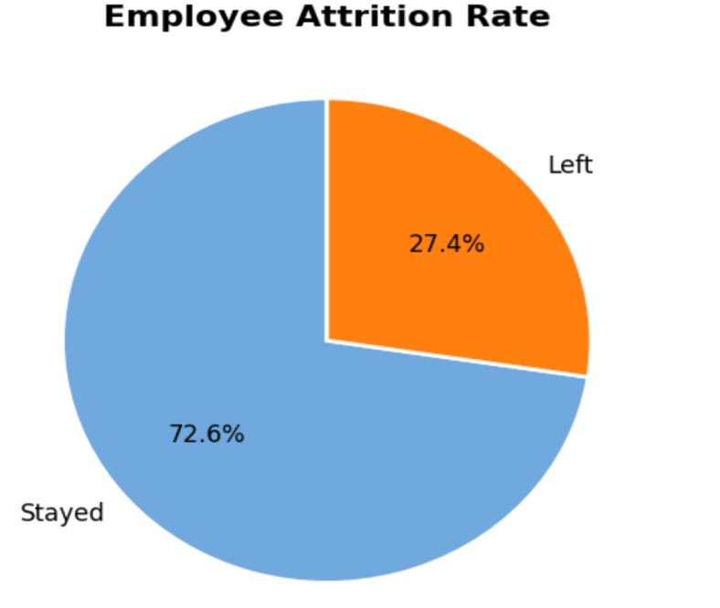
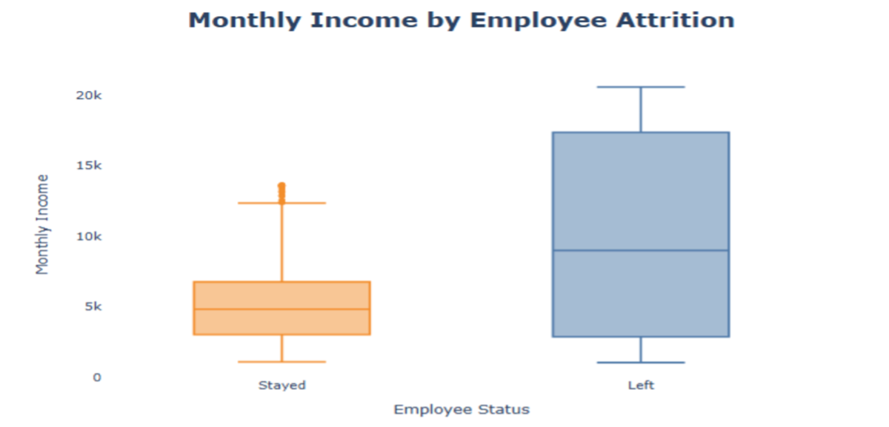
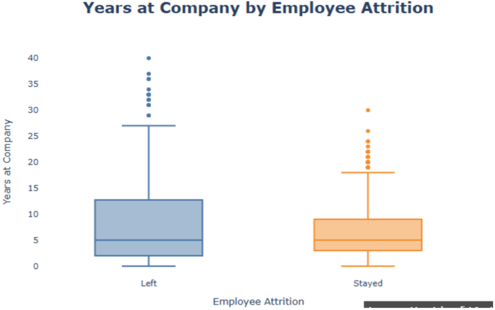
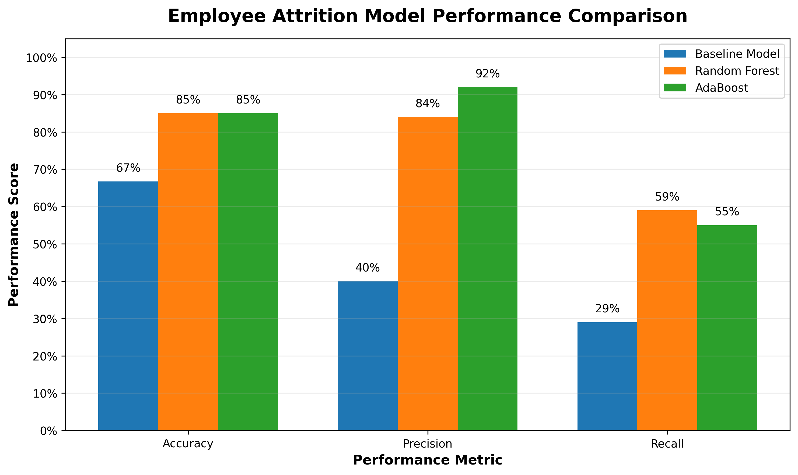

# Predicting Employee Attrition Using Machine Learning

## Project Overview

This project examines whether historical workforce characteristics can be used to identify employees who may be at greater risk of leaving an organization.

The analysis combines exploratory data analysis, feature engineering, and supervised machine learning to evaluate employee attrition patterns and compare multiple predictive approaches. The project progresses from an initial baseline model to more advanced Random Forest and AdaBoost classifiers, allowing model performance to be evaluated not only by accuracy but also by precision and recall.

The goal is to demonstrate how predictive analytics can support proactive employee-retention planning while recognizing that model selection should reflect organizational priorities.

## Business Objective

Employee attrition can create significant costs related to recruiting, onboarding, training, lost expertise, and operational disruption.

The primary analytical question was:

**Can historical workforce characteristics help identify employees who may be at greater risk of attrition?**

A secondary objective was to determine which predictive model would provide the most useful decision support depending on whether HR prioritizes:

- identifying a broader share of employees who may leave, or
- reducing false-positive predictions and targeting interventions more selectively.

## Tools and Technologies

- Python
- Pandas
- NumPy
- Scikit-learn
- Jupyter Notebook
- Power BI
- Exploratory Data Analysis
- Feature Engineering
- One-Hot Encoding
- Train/Test Splitting
- Random Forest
- AdaBoost
- Classification Metrics

## Analytical Workflow

1. Combined employee and organizational HR datasets using the EmployeeNumber field.
2. Reviewed workforce characteristics and employee attrition outcomes.
3. Prepared the merged dataset for analysis and evaluated data quality.
4. Developed an initial baseline attrition model.
5. Conducted exploratory analysis to identify patterns associated with employee turnover.
6. Engineered additional compensation and tenure-related features.
7. Converted categorical workforce variables into numerical values using one-hot encoding.
8. Split the data into training and testing sets.
9. Developed Random Forest and AdaBoost classification models.
10. Evaluated model performance using accuracy, precision, and recall.
11. Interpreted model tradeoffs in the context of HR retention priorities.

## Baseline Model

The initial model used a limited set of workforce characteristics to establish a benchmark for predicting employee attrition.

The baseline model achieved approximately:

- **72.7% training accuracy**
- **66.7% testing accuracy**
- **40% testing precision**
- **29% testing recall**

The relatively low precision and recall indicated that the baseline model had limited ability to reliably identify employees who ultimately left the organization.

This baseline provided a benchmark for evaluating whether additional features and more advanced machine learning algorithms could improve predictive performance.

## Exploratory Analysis

Exploratory data analysis was used to better understand the workforce and identify characteristics that could contribute useful information to the predictive models.

Key observations included:

- Approximately **27.4% of employees experienced attrition**, compared with 72.6% who remained.
- Monthly income showed substantial overlap between employees who stayed and employees who left.
- Years at the company also showed considerable overlap across attrition groups.
- Individual workforce characteristics alone did not clearly distinguish employees who would leave.

These findings supported the use of multiple workforce characteristics together rather than relying on any single variable to explain employee attrition.

### Employee Attrition Rate

Approximately 27.4% of employees experienced attrition, indicating a meaningful retention concern within the workforce.

### Monthly Income by Attrition

Monthly income varied across employees who stayed and those who left, but the distributions showed substantial overlap. This suggests that income alone does not clearly distinguish employees who will experience attrition.

### Years at Company by Attrition

Years at the company also showed considerable overlap between attrition groups. Although employees who left showed greater variability, tenure alone was not sufficient to clearly identify employees at risk of leaving.

## Feature Engineering

Feature engineering was used to expand the information available to the predictive models.

The workflow included:

- creating compensation-related features such as HighIncome;
- creating tenure-related variables;
- selecting workforce characteristics relevant to employee attrition;
- converting categorical variables such as department, job role, marital status, and gender using one-hot encoding;
- preparing the resulting dataset for supervised machine learning.

## Model Comparison

Two machine learning classification algorithms were compared: **Random Forest** and **AdaBoost**.

### Random Forest

Random Forest achieved approximately:

- **85% testing accuracy**
- **84% precision**
- **59% recall**

Its stronger recall allowed it to identify a larger share of employees who ultimately experienced attrition.

### AdaBoost

AdaBoost achieved approximately:

- **85% testing accuracy**
- **92% precision**
- **55% recall**

Its higher precision resulted in more reliable positive predictions and fewer false positives.

### Model Performance Comparison

Compared with the initial baseline model, both ensemble models produced substantial improvements in predictive performance. Random Forest achieved the strongest recall, while AdaBoost achieved the strongest precision.

## Key Findings

- Historical workforce data provided useful predictive information about employee attrition.
- The baseline model established a benchmark but demonstrated limited precision and recall.
- Expanding the feature set and applying ensemble machine learning algorithms substantially improved predictive performance.
- Random Forest and AdaBoost achieved similar overall accuracy but produced different precision-recall tradeoffs.
- Accuracy alone was not sufficient for selecting the most appropriate model.
- The best model depends on the organization's retention goals and available intervention resources.

## Business Interpretation

The model comparison illustrates an important business tradeoff.

**Random Forest** may be more appropriate when HR wants to identify a broader share of employees who may be at risk of leaving. Higher recall helps reduce the number of potentially at-risk employees who are missed.

**AdaBoost** may be more appropriate when HR wants to target retention resources more selectively. Higher precision reduces false-positive predictions and focuses intervention efforts on employees more likely to experience attrition.

The models should therefore be used as decision-support tools rather than as standalone decision makers.

## Recommendations

- Use predictive results alongside broader workforce information when planning retention initiatives.
- Prioritize Random Forest when broader identification of attrition risk is more important.
- Prioritize AdaBoost when reducing false positives and targeting limited retention resources is the higher priority.
- Monitor model performance as workforce characteristics change over time.
- Retrain and reevaluate predictive models as new employee data becomes available.
- Avoid relying on any single workforce characteristic when assessing attrition risk.

## Project Files

- [Analysis Notebook](notebooks/employee_attrition_analysis.ipynb)
- [Project Visualizations](images/)
- [Power BI Dashboard](power-bi/employee_attrition_power_bi_dashboard.pdf)
- [Project Presentation](presentation/)
- [Analytical Report](report/)
- [Data Availability](data/)

## Data Note

The original human resources datasets used in this analysis were provided through university coursework and are not redistributed in this repository because no explicit redistribution license was provided.

This repository focuses on the analytical workflow, machine learning methodology, summarized results, visualizations, and business interpretation developed for portfolio demonstration.

## Project Background

This analysis was originally completed across two applied data analytics coursework projects. The work has been consolidated and reformatted as a professional portfolio case study to demonstrate exploratory analysis, feature engineering, predictive modeling, model evaluation, and business-focused interpretation.
